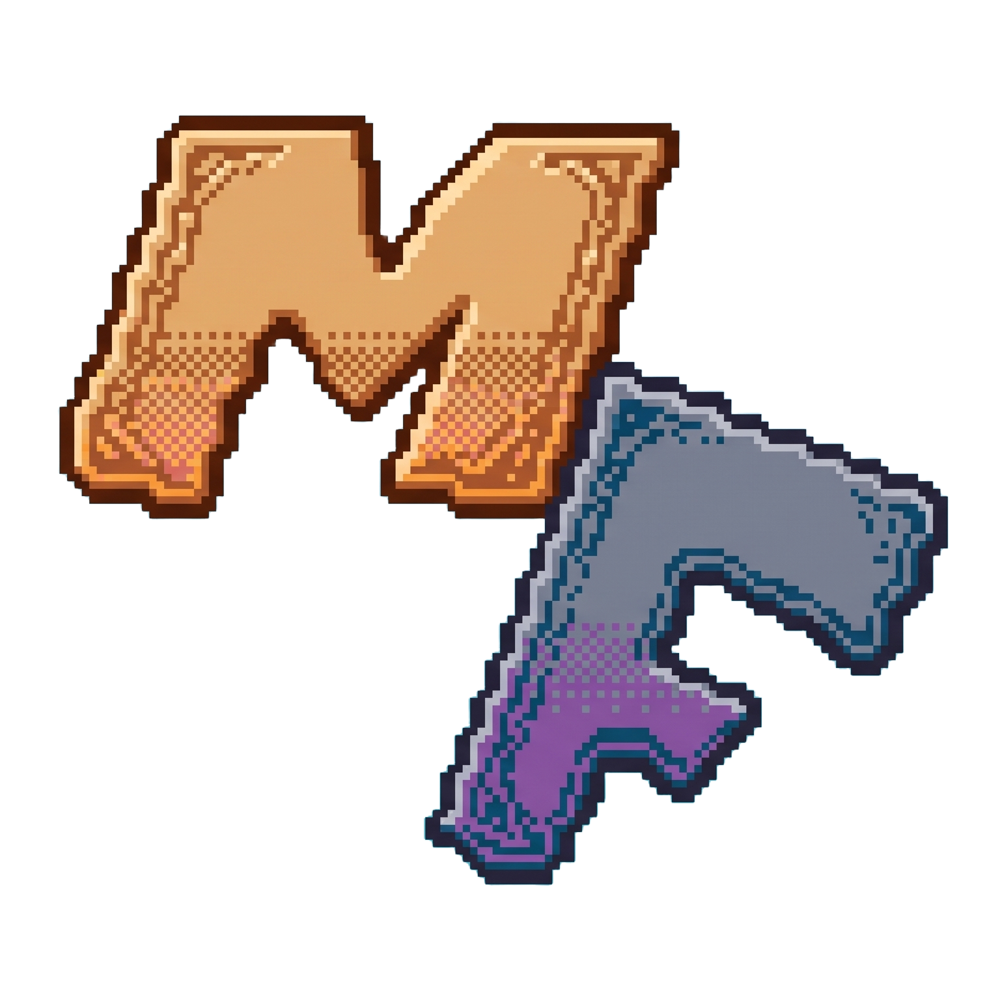

  
   
   
  <h1>Mothfall</h1>
  

    "Archipelago guide" for the Minecraft building community.
  

  

    
    
    
    
    
    
  

---

## ✈️ About

**Mothfall** is a long-standing collaborative Minecraft building server founded in 2017. It opened publicly in 2024.

This repository powers the official website, themed vaguely around a vintage postcard and travel guide aesthetic.

| 🌐 Website | 🎮 Server IP | 💬 Discord |
| :--- | :--- | :--- |
| [mothfall.world](https://mothfall.world) | `play.mothfall.world` | [Join Discord](https://discord.gg/btDtUeyWsV) |

---

  Crafted with care for the dreamers of Mothfall. Wish you were here! 🍂✈️

